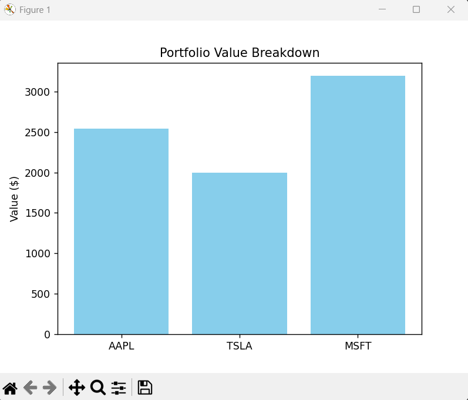

# Mini-Portfolio-Tracker

A Python project that calculates and visualizes the total value of a stock portfolio. This tool helps track your investments in real-time and provides quick insights into daily performance and portfolio distribution.

## Features
- Fetches latest stock prices using `yfinance`
- Calculates total portfolio value
- Computes daily percentage changes for each stock
- Visualizes portfolio allocation with a bar chart

## Tech Stack
- Python
- Pandas
- Matplotlib
- yfinance

## Installation
```bash
pip install yfinance pandas matplotlib
```

## Usage

- Update the portfolio dictionary in the script with your stocks and quantities.
- Run the script: 
```bash
python portfolio_tracker.py
```
- See total portfolio value, daily % changes, and bar chart visualization.

## Skills Demonstrated

- Python programming
- Data fetching from APIs
- Data processing with Pandas
- Data visualization with Matplotlib
- Basic financial data analysis

## Example Output


``` bash
{'AAPL': np.float64(254.22999572753906), 'TSLA': np.float64(399.2699890136719), 'MSFT': np.float64(399.4100036621094)}

AAPL: 10 shares x $254.23 = $2542.30
TSLA: 5 shares x $399.27 = $1996.35
MSFT: 8 shares x $399.41 = $3195.28
Total Portfolio Value: $7733.93

AAPL daily change: 0.56%
TSLA daily change: 0.94%
MSFT daily change: -0.14%
```